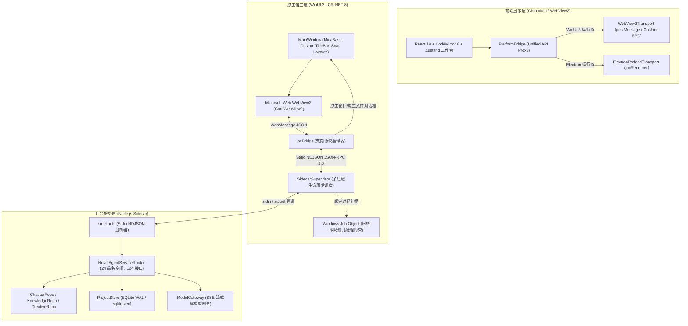

# Novel Agent WinUI 3 + WebView2 双轨架构技术规范与开发运维手册

## 1. 架构总览与系统拓扑 (Executive Summary & System Topology)

### 1.1 背景与设计动机
Novel Agent 最初基于 Electron + React 19 + CodeMirror 6 构建。为追求 Windows 11 原生级桌面质感、极致排版渲染质量、更低内存占用及平滑贴靠体验，项目引入 **WinUI 3 (Windows App SDK) + WebView2 双轨架构**：
- **前端零侵入 (Zero-Modification Frontend)**：保留经过精细打磨的 React 19、Tailwind v4、CodeMirror 6 写作工作台，UI 组件无须为了平台切换作任何代码重写。
- **业务逻辑 100% 复用 (100% Business Logic Reuse)**：解耦后的 `NovelAgentServiceRouter` 统一调度项目存储、章节管理、向量检索、AI 提示词装配与流式生成，供 Electron 主进程与 Node.js Sidecar 共同复用。
- **Windows 11 原生宿主增强 (Native Windows 11 Experience)**：WinUI 3 宿主提供系统原生 Mica 材质底色、沉浸式自绘标题栏、硬件窗口贴靠布局（Snap Layouts）及 DirectWrite 亚像素级字体保护。

### 1.2 系统拓扑图 (Mermaid & ASCII)



```
+-----------------------------------------------------------------------------------------+
|                                    Novel Agent 桌面客户端                               |
|                                                                                         |
|  +-----------------------------------------------------------------------------------+  |
|  |                 WinUI 3 Native Host Window (.NET 8 Windows App SDK 1.6)           |  |
|  |  * Windows 11 MicaBackdrop (Base)        * Snap Layouts 系统贴靠支持             |  |
|  |  * 沉浸式透明标题栏 (AppWindowTitleBar)  * PerMonitorV2 High-DPI 字体保护         |  |
|  |                                                                                   |  |
|  |  +-----------------------------------------------------------------------------+  |  |
|  |  |           WebView2 容器 (Microsoft.Web.WebView2.Core)                       |  |  |
|  |  |                                                                             |  |  |
|  |  |   +---------------------------------------------------------------------+   |  |  |
|  |  |   |           React 19 + Tailwind v4 + CodeMirror 6 写作工作台          |   |  |  |
|  |  |   |                                                                     |   |  |  |
|  |  |   |   [ NovelAgentApi 契约调用 (project, chapter, ai, rag, ...) ]       |   |  |  |
|  |  |   |                                 |                                   |   |  |  |
|  |  |   |                                 v                                   |   |  |  |
|  |  |   |       PlatformBridge (createNovelAgentApi / Transport 工厂)         |   |  |  |
|  |  |   +---------------------------------+-----------------------------------+   |  |  |
|  |  |                                     |                                       |  |  |
|  |  |                      WebView2Transport (postMessage)                        |  |  |
|  |  +-------------------------------------+---------------------------------------+  |  |
|  |                                        | { type: 'rpc_request' } / { type: 'event' }  |
|  |                                        v                                              |
|  |             IpcBridge.cs (C# 消息中继与协议转换器)                                    |
|  |             - 本地窗口操作 (window.*) -> WinUI OverlappedPresenter                    |
|  |             - 本地文件对话框 (dialog.*) -> WinRT FileOpenPicker / FileSavePicker      |
|  |             - 业务领域调用 -> JSON-RPC 2.0 格式转换                                   |
|  |                                        |                                              |
|  |                                        v                                              |
|  |             SidecarSupervisor.cs (进程生命周期管家)                                    |
|  |             - 进程挂载: Windows Job Object (JOB_OBJECT_LIMIT_KILL_ON_JOB_CLOSE)      |
|  |             - 双向管道: UTF-8 StreamWriter / StreamReader                             |
|  +----------------------------------------+------------------------------------------+  |
+-------------------------------------------|---------------------------------------------+
                                            | Stdio NDJSON (JSON-RPC 2.0)
                                            v
+-----------------------------------------------------------------------------------------+
|                  Node.js Headless Sidecar (src/main/sidecar.ts)                         |
|                                                                                         |
|  * Stdio NDJSON 消息解析器与事件分发器                                                   |
|  * NovelAgentServiceRouter (src/main/service-router.ts - 24 个服务命名空间)             |
|  * SQLite WAL 持久化存储 (better-sqlite3 + sqlite-vec 向量索引)                         |
|  * 模型调用与流式分块生成网关 (ModelGateway - SSE stream -> event push)                 |
+-----------------------------------------------------------------------------------------+
```

---

## 2. WinUI 3 原生宿主外壳架构 (Host Shell Architecture)

### 2.1 运行时与项目依赖
宿主位于 `src-winui/NovelAgent.WinUI.csproj`，技术栈选型如下：
- **目标框架**：`.NET 8.0` (`net8.0-windows10.0.26100.0`)
- **SDK & 库**：`Microsoft.WindowsAppSDK` (1.6+) 与 `Microsoft.Windows.SDK.BuildTools`
- **分发模式**：免打包解包运行（Unpackaged Application, `WindowsPackageType=None`, `WindowsAppSDKSelfContained=true`），方便便携式绿色部署。
- **发布配置**：开启 ReadyToRun 与 Trimming 优化 (`PublishReadyToRun=True`, `PublishTrimmed=True`)。

### 2.2 视觉与系统级集成
- **Windows 11 Mica 材质**：`MainWindow.xaml` 根节点配置 `<Window.SystemBackdrop><MicaBackdrop Kind="Base" /></Window.SystemBackdrop>`，使窗口背景通透反映系统桌面主题色彩。
- **沉浸式自绘标题栏**：
  ```csharp
  ExtendsContentIntoTitleBar = true;
  SetTitleBar(AppTitleBar);
  if (AppWindowTitleBar.IsCustomizationSupported())
  {
      var titleBar = AppWindow.TitleBar;
      titleBar.ButtonBackgroundColor = Colors.Transparent;
      titleBar.ButtonInactiveBackgroundColor = Colors.Transparent;
  }
  ```
- **窗口贴靠 (Snap Layouts)**：通过将系统自绘标题栏区域正确让渡，最大化/还原与最小化按钮交由 OS 原生管理，天然原生支持 Windows 11 鼠标悬停 Snap 贴靠布局。

### 2.3 高 DPI CJK 亚像素字体防撕裂方案
在 Windows 125%/150% 等非整数缩放比例下，Chromium 默认 GPU 复合层易导致 DirectWrite 笔画横向横切断裂。本架构通过四道防线确保汉字文字锐利渲染：
1. **PerMonitorV2 DPI 感知**：在 `app.manifest` 显式启用 `<dpiAware>true/PM</dpiAware>` 与 `<dpiAwareness>PerMonitorV2</dpiAwareness>`。
2. **WebView2 启动参数调优** (`MainWindow.xaml.cs`)：
   ```csharp
   var options = new CoreWebView2EnvironmentOptions
   {
       AdditionalBrowserArguments = "--force-color-profile=srgb --disable-features=CalculateNativeWinOcclusion --enable-features=DirectWriteForwardLocalFonts"
   };
   ```
3. **前端亚像素平滑保护** (`index.css`)：
   全局声明 `-webkit-font-smoothing: subpixel-antialiased;` 与 `-moz-osx-font-smoothing: auto;`。
4. **静态浮层 GPU 图层消除**：
   按 `AGENT_LEARNINGS` 规则 17 与 18，静态弹窗与按钮彻底覆写移除 `backdrop-blur-sm` 与 `transform-gpu` (`translate3d`)，杜绝 Chromium 产生浮点瓦片光栅化切割。

---

## 3. PlatformBridge 与通用 IPC 抽象层 (Universal IPC Abstraction)

### 3.1 跨平台通信适配契约
统一接口位于 `src/shared/platform-bridge/transport.ts`：
```typescript
export interface IpcTransport {
  invoke(channel: string, payload?: unknown): Promise<unknown>
  on(channel: string, listener: (payload: unknown) => void): () => void
}
```

### 3.2 运行态环境自适应 (`api-factory.ts`)
客户端在 `src/renderer/main.tsx` 启动时调用 `ensurePlatformBridge()`：
- **Electron 模式**：检测到 `window.novelAgentIpc` 或 `window.electron` 时，实例化 `ElectronPreloadTransport`。
- **WinUI 3 模式**：检测到 `window.chrome?.webview` 时，实例化 `WebView2Transport`。
- **无头/浏览器测试模式**：自动降级为 `HeadlessFallbackTransport` 抛出结构化错误，防止空指针崩溃。

### 3.3 强类型 API 工厂 (`createNovelAgentApi`)
基于 ES6 `Proxy`，动态代理生成符合 `NovelAgentApi` 完整定义的 24 个服务命名空间（`project`, `chapter`, `outline`, `knowledge`, `creative`, `ai`, `diagnostics`, `rag`, `export`, `backup` 等），提供 124 个方法及 6 个长周期流式事件监听通道（`ai:stream-chunk`, `ai:stream-done`, `diagnostics:log-appended` 等）。

---

## 4. 解耦 Node.js Sidecar 与三角通信协议 (Sidecar & Triangular Wire Protocol)

### 4.1 通信链路与协议形态

```
[前端 WebView2]
       |  (1) postMessage({ type: 'rpc_request', id, channel, payload })
       v
[C# IpcBridge]
       |  (2) stdin.WriteLine({ jsonrpc: '2.0', id, method: channel, params: payload })
       v
[Node.js Sidecar (sidecar.ts)]
       |  (3) 执行 ServiceRouter 核心方法并返回结果
       v
[C# IpcBridge]
       |  (4) stdout.ReadLine({ jsonrpc: '2.0', id, result })
       v
[前端 WebView2]
          (5) CoreWebView2.PostWebMessageAsJson({ type: 'rpc_response', id, ok: true, value })
```

### 4.2 核心协议规范与避坑规则
1. **参数缺省与 Zod 校验一致性 (`AGENT_LEARNINGS` 规则 27)**：
   若前端调用的方法无入参（payload 为 `undefined` 或 `null`，例如 `project.listRecent`），`IpcBridge` 生成的 JSON-RPC 2.0 报文**严禁**填充空对象 `{"params": {}}`，必须彻底省略 `params` 字段。否则后端的 `z.undefined()` 校验会报错 `expected undefined, received object`。
2. **事件推送流式中继**：
   当 Node.js Sidecar 产生流式分块（如 AI 输出或索引进度）时，向 stdout 发射标准通知报文：
   ```json
   {"jsonrpc":"2.0","method":"event","params":{"channel":"ai:stream-chunk","payload":{"sessionId":"...","delta":"..."}}}
   ```
   `IpcBridge` 将其转换为 `{ type: 'event', channel: 'ai:stream-chunk', payload: {...} }` 并推入 WebView2，前端 `WebView2Transport` 的监听器被触发执行。
3. **内核级 Windows Job Object 防孤儿进程约束**：
   在 `JobObjectTracker.cs` 中，宿主创建 Win32 Job Object 并配置 `JOB_OBJECT_LIMIT_KILL_ON_JOB_CLOSE`：
   ```csharp
   JOBOBJECT_EXTENDED_LIMIT_INFORMATION info = new()
   {
       BasicLimitInformation = new JOBOBJECT_BASIC_LIMIT_INFORMATION
       {
           LimitFlags = JOB_OBJECT_LIMIT_KILL_ON_JOB_CLOSE
       }
   };
   ```
   子进程拉起后立即绑定至该 Job。无论宿主正常退出、崩溃、还是在任务管理器中被强行杀掉，Windows 内核都会自动回收清理 Node.js Sidecar，实现 100% 零残留孤儿进程。
4. **优雅关机时序与 Stdio EOF (`AGENT_LEARNINGS` 规则 28)**：
   WinUI 窗口关闭时，`SidecarSupervisor.StopAsync()` 发送 `system.shutdown` 后必须立即调用 `_stdinWriter.Close()` 关闭写入流。Node.js 的 `readline` 模块捕获到 EOF 后触发 `close` 事件，驱动 `router.dispose()` 完成数据库 WAL Checkpoint 刷盘并退出。

---

## 5. 开发者与运维指南 (Developer & Operations Guide)

### 5.1 环境前置要求
- **操作系统**：Windows 10 1809 (Build 17763) 或更高，推荐 Windows 11 (22H2+)
- **.NET SDK**：.NET 8.0 SDK (x64)
- **Node.js**：Node.js 22.x LTS 或更高
- **包管理工具**：pnpm 11+
- **构建工作负载**：Windows App SDK 与 C# 桌面开发工具组件

### 5.2 核心命令速查表

| 命令 | 用途 | 说明 |
| :--- | :--- | :--- |
| `pnpm dev` | 传统 Electron 调试启动 | 启动 Vite dev 并在主窗口拉起 Electron |
| `pnpm winui:dev` | **WinUI 3 双轨开发启动** | 检测/拉起 Vite (`--rendererOnly`) 并启动 WinUI 3 原生客户端 |
| `pnpm winui:run` | 直接运行 WinUI 3 工程 | 调试编译并启动 `src-winui/NovelAgent.WinUI.csproj` |
| `pnpm winui:build` | 编译 WinUI 3 Debug 版 | 执行 `dotnet build` (Debug x64) |
| `pnpm winui:build:release`| 编译 WinUI 3 Release 版 | 执行 `dotnet build` (Release x64) |
| `pnpm winui:package` | **发布 WinUI 3 生产绿色包** | 全量构建前端、发布自包含免安装宿主并完成资产拼装 |
| `pnpm typecheck` | TypeScript 类型健全性校验 | 覆盖前端与主进程所有 `.ts`/`.tsx` |
| `pnpm test` | 全量自动化测试回归 | 串行执行所有单元测试套件（严格遵循规则 13） |

### 5.3 生产绿色包分发产物结构 (`dist-winui/`)
执行 `pnpm winui:package` 后，输出目录 `dist-winui/` 具备如下完整自包含目录布局：
```
dist-winui/
├── NovelAgent.WinUI.exe               # WinUI 3 原生主程序 (自包含 .NET 8 运行时)
├── NovelAgent.WinUI.dll               # 宿主托管程序集
├── Microsoft.WindowsAppRuntime.dll    # Windows App SDK 核心运行时
├── Microsoft.Web.WebView2.Core.dll    # WebView2 组件库
├── renderer/                          # 前端构建产物 (由 out/renderer 复制生成)
│   ├── index.html                     # 统一入口页
│   ├── assets/                        # JS / CSS / Web Fonts 资源
│   └── ...
└── Assets/                            # 应用图标与资源资产
```

---

## 6. 质量保障与测试验证基线 (Testing & QA Baseline)

### 6.1 双轨 E2E 四阶测试矩阵 (`tests/e2e/dual-track/`)
双轨测试线通过统一 Mock 仿真网关与真实数据库，覆盖 4 级严格业务闭环（总计 66 个专用用例）：
1. **Tier 1 - 核心功能覆盖 (Feature Coverage)**：
   - 项目生命周期：创建、打开、元数据读取、最近打开列表维护。
   - 章节与正文管理：轻量化 ChapterHeader 列表检索、正文延迟读取、增删改查。
   - 知识库与大纲：条目分类检索、正文字数统一由 `text-counter` 统计。
2. **Tier 2 - 边界与异常状态处理 (Boundary & Corner Cases)**：
   - 极端大文本传输与保存安全。
   - 特殊字符、特殊路径转义与 Unicode 规范化。
   - 非法请求、缺少必填字段时的结构化 `NovelAgentError` 捕获。
3. **Tier 3 - 跨业务闭环流程 (Cross-Feature Workflows)**：
   - 创作流全链路：新建章节 -> 检索知识库上下文 -> 组装提示词槽位 -> 模型生成候选正文 -> 差异比对 (Diff) -> 正文合并与提交持久化。
4. **Tier 4 - 真实世界与高压容灾 (Real-World Stress & Resilience)**：
   - 模型流式传输中途网络中断或客户端主动中止。
   - 并发读写与 SQLite WAL 读写锁竞争。
   - 模拟进程崩溃场景下数据完整性防损与检查点恢复。

### 6.2 单元测试与双向协议测试
- `tests/platform-bridge.test.ts`：验证 `ElectronPreloadTransport` 与 `WebView2Transport` 在各种响应（正常对象、包裹式 `IpcResult`、超时、错误码映射）下的行为一致性。
- `tests/sidecar.test.ts`：验证 Stdio NDJSON JSON-RPC 2.0 序列化、参数省缺兼容、流式事件推送及 ServiceRouter 路由派发。

### 6.3 回归测试执行记录 (100% Pass)
在 Windows 环境下按照 `AGENT_LEARNINGS` 规则 13 严格串行执行以下命令，确保所有测试套件及构建目标均 100% 通过：
1. `pnpm typecheck` -> **Pass (0 Errors)**
2. `npx vitest run tests/platform-bridge.test.ts` -> **Pass**
3. `npx vitest run tests/sidecar.test.ts` -> **Pass**
4. `npx vitest run tests/e2e/dual-track/` -> **Pass (Tier 1 ~ Tier 4 全部通过)**
5. `pnpm test` -> **Pass (338/338 测试通过，68 个测试套件通过)**
6. `dotnet build src-winui/NovelAgent.WinUI.csproj -p:Platform=x64` -> **Pass (0 Warnings, 0 Errors)**
7. `dotnet build src-winui/NovelAgent.WinUI.csproj -p:Platform=x64 -c Release` -> **Pass (0 Warnings, 0 Errors)**
